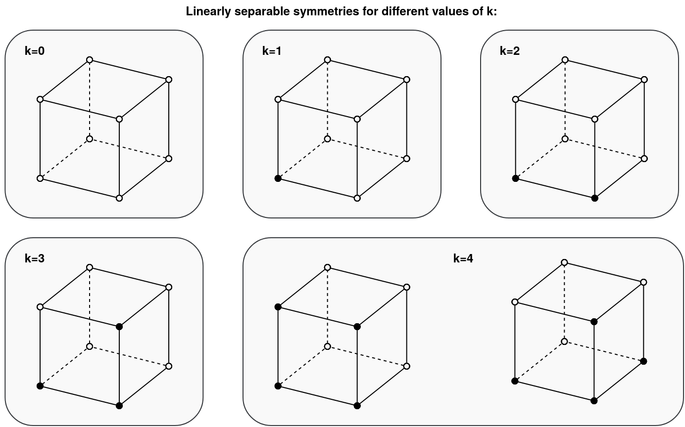

## 1. How many 3D Boolean functions are there?

Each 3D Boolean function has 3 inputs, where each input can either be `true` or `false` (so only 2
possibilities). Hence, there are $2^3=8$ combinations of these 3 input variables.

Each of these combinations above can be mapped to the output of either `true` or `false` (again 2
possibilities). Hence, there are a total of $2^8=256$ such mappings possible, and this is the reason
why there are $256$ different 3D Boolean functions.

In general, there are $2^{(2^n)}$ nth-dimensional Boolean functions.

## 2. How many symmetries of 3D Boolean functions mapping 2 input patterns to 1?

For each cube representing a 3D Boolean function, a white corner will represent target $t^{(\mu)}=0$
and a black corner will represent target $t^{(\mu)}=1$.

This means a 3D Boolean function that maps 2 of the 8 possible inputs patterns to 1 must have a cube
where exactly 2 of corners are colored black.

In this case, we will have 3 symmetries in total:

* **Symmetry 1**: This is when 2 corners on the same edge of the cube are black.
* **Symmetry 2**: This is when 2 corners on the diagonal of a surface of the cube are black.
* **Symmetry 3**: This is when 2 corners on the diagonal of the cube itself are black.

## 3. How many linearly separable 3D Boolean functions are there?

Graphically speaking, a 3D Boolean function is linearly separable if it can be represented by a cube
where it is possible for a 2D plane to separate all white corners from black corners. This can only
be achieved if a black corner is connected to at least another black corner (in case there are 2 or
more black corners in the cube). Si our strategy is to identify all symmetries that are linearly
separable, and then count how many Boolean functions belong to each of the symmetries.

Let $k$ be the number of black corners in the cube. For each $k\in\{1,\dots,8\}$, the idea now is to
identify all symmetries that are linearly separable. As shown in the figure below, there is only 1
such symmetry for $k\in\{0,1,2,3\}$, but there are 2 such symmetries for $k=4$.

* For $k=0$, the symmetry has 1 Boolean function, where all corners are white.

* For $k=1$, the symmetry has 8 Boolean functions, because the black corner can be placed on any of
    the 8 corners of the cube.

* For $k=2$, the symmetry has 12 Boolean functions, because the 2 black corners can be placed along
    any of the 12 edges of the cube.

* For $k=3$, the symmetry has 24 Boolean functions. This is because the 3 black corners can actually
    be placed in 4 different ways (or orientations if you will) on a single surface of the cube. And
    since the cube has 6 surfaces, this amounts to $4\times 6=24$ functions.

* For $k=4$, the 1st symmetry has 6, and 2nd one has 8, giving the total of 14 Boolean functions.

    The 1st symmetry has 6 functions, because the 4 black corners can be placed on any of the 6
    surfaces of the cube.

    The 2nd symmetry has 8 functions, because the "middle" black corner (the one that is connected
    to the other 3 black corners) can be placed on any of the 8 corners of the cube.

Note that we don't have to do the same analysis for $k\in\{5,6,7,8\}$, because having $k$ black
corners is also the same as having $8-k$ white corners, which will give the same results as when
$k\in\{0,1,2,3\}$. This also means we need to multiply the results by 2 for each v$k\in\{0,1,2,3\}$.

Therefore, the total number of 3D Boolean functions are that linearly separable is:
$(1+8+12+24)\times 2 + 14 = 104$.

