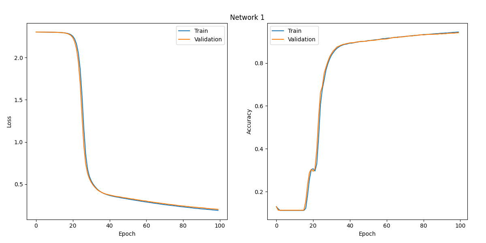

<!--------------------------------------------------------------------------------------->
## 1. Presentation of results


*Figure 1: Training performance of network 1*


*Figure 2: Training performance of network 2*

*Table 1: Training performance of network 2:*

|          | Train Accuracy | Validation Accuracy | Test Accuracy |
|----------|----------------|---------------------|---------------|
| Network1 | 0.94446        | 0.94090             | 0.94630       |
| Network2 | 0.99998        | 0.99050             | 0.99080       |

Analysis of the results:

* Compared to network1 (that has only 1 convolutional layer), network2 is much deeper as it has 3
    convolutional layers with batch-norm in between. The deep structure allows network2 to pack more
    non-linearity that would allow the network to learn more complex features from the images.
* As you can see from the Figure 1 and Figure 2, network2 overfits much faster on the training set,
    while network2 has very much the same performance on both training and validation set across all
    epochs. This is because the deeper structure makes network2 more vulnerable to noises from the
    training set.
* However, as training goes on, network2 is able to give a better overall performance than network2
    on the same number of epochs. This is no suprise, since network2 is deeper, and thus yields a
    better performance, but only if it's trained long enough.

I have done my implementation using Keras API of Tensorflow 2.2. Since the assignment was written
for Matlab, I had to make a couple of changes to make it work in Python:

* Instead of using the provided `LoadMNIST.m` script, I wrote my own method for loading the MNIST
    dataset from Tensorflow, and split it into train/val/test set with ratio of 50000/10000/10000.
    Since Tensorflow only provides train and test set, I had to create validation set by randomly
    sample 10000 data points from the original train set.
* Tensorflow defines `ValidationFrequency` with respect to number of *epochs*, instead of number of
    *iterations* as in Matlab. So for simplicity, I took the liberty to perform evaluation on the
    validation set once every epoch.
* I set the learning rate for both networks to be 0.01, and the max number of epochs is set to 100.

<!--------------------------------------------------------------------------------------->
\newpage

# 2. Code

```python
import os
import argparse
import numpy as np
import tensorflow as tf
import matplotlib.pyplot as plt
from tensorflow.keras.optimizers import SGD
from tensorflow.keras.initializers import RandomNormal
from tensorflow.keras.callbacks import EarlyStopping
from tensorflow.keras.losses import SparseCategoricalCrossentropy
from tensorflow.keras.layers import Conv2D, Dense, Flatten, MaxPool2D, InputLayer, BatchNormalization

def load_mnist(val_seed=None):
    """
    Load, pre-process, and split the MNIST dataset into train/val/test sets.

    Arguments:
        val_seed (int): Seed to generate the validation set.

    Returns:
        (x_train, y_train): ndarray of shape (50000, 28, 28, 1) and (50000,) representing train set.
        (x_val, y_val)    : ndarray of shape (10000, 28, 28, 1) and (10000,) representing val set.
        (x_test, y_test)  : ndarray of shape (10000, 28, 28, 1) and (10000,) representing test set.
    """
    saved_random_generator_state = np.random.get_state()
    np.random.seed(val_seed)

    (x, y), (x_test, y_test) = tf.keras.datasets.mnist.load_data()
    x, x_test = np.expand_dims(x, axis=3), np.expand_dims(x_test, axis=3)
    x, x_test = x / 255.0, x_test / 255.0

    indices = np.random.permutation(x.shape[0])
    train_indices, val_indices = indices[:50000], indices[50000:]
    x_train, y_train = x[train_indices], y[train_indices]
    x_val, y_val = x[val_indices], y[val_indices]

    print("[INFO] Train set shapes:", x_train.shape, y_train.shape)
    print("[INFO] Validation set shapes:", x_val.shape, y_val.shape)
    print("[INFO] Test set shapes:", x_test.shape, y_test.shape)

    np.random.set_state(saved_random_generator_state)
    return (x_train, y_train), (x_val, y_val), (x_test, y_test)

def predict(model, inputs):
    return tf.argmax(tf.nn.softmax(model(inputs)), axis=-1)

def construct_network1():
    model = tf.keras.models.Sequential([
        InputLayer(input_shape=(28, 28, 1)),
        Conv2D(20, 5, kernel_initializer=RandomNormal(0, 0.01), padding="same", activation="relu"),
        MaxPool2D(pool_size=2, strides=2, padding="same"),
        Flatten(),
        Dense(100, kernel_initializer=RandomNormal(0, 0.01), activation="relu"),
        Dense(10, kernel_initializer=RandomNormal(0, 0.01)),
    ])
    model.compile(
        optimizer=SGD(learning_rate=0.01, momentum=0.9),
        loss=SparseCategoricalCrossentropy(from_logits=True),
        metrics=["accuracy"],
    )
    model.summary()
    return model

def construct_network2():
    model = tf.keras.models.Sequential([
        InputLayer(input_shape=(28, 28, 1)),
        Conv2D(20, 3, kernel_initializer=RandomNormal(0, 0.01), padding="same", activation="relu"),
        BatchNormalization(),
        MaxPool2D(pool_size=2, strides=2, padding="same"),
        Conv2D(30, 3, kernel_initializer=RandomNormal(0, 0.01), padding="same", activation="relu"),
        BatchNormalization(),
        MaxPool2D(pool_size=2, strides=2, padding="same"),
        Conv2D(50, 3, kernel_initializer=RandomNormal(0, 0.01), padding="same", activation="relu"),
        BatchNormalization(),
        MaxPool2D(pool_size=2, strides=2, padding="same"),
        Flatten(),
        Dense(10, kernel_initializer=RandomNormal(0, 0.01)),
    ])
    model.compile(
        optimizer=SGD(learning_rate=0.01, momentum=0.9),
        loss=SparseCategoricalCrossentropy(from_logits=True),
        metrics=["accuracy"],
    )
    model.summary()
    return model

def main(args):
    training_performance = None
    (x_train, y_train), (x_val, y_val), (x_test, y_test) = load_mnist(val_seed=123)
    model = construct_network1() if args.network == 1 else construct_network2()

    if args.model_file is not None:
        print("\n[INFO] Loading model from " + args.model_file)
        model = tf.keras.models.load_model(args.model_file)

    else:
        print("\n[INFO] No model file is given, proceed to training")
        training_performance = model.fit(
            x_train,
            y_train,
            validation_data=(x_val, y_val),
            shuffle=True,
            batch_size=8192,
            epochs=100,
            callbacks=EarlyStopping(patience=5),
        )
        training_performance = training_performance.history
        fig = plt.figure(figsize=(12, 6))
        plt.title("Network {}".format(args.network))
        plt.tight_layout(pad=2.5)
        plt.axis("off")

        fig.add_subplot(1, 2, 1)
        plt.plot(training_performance["loss"])
        plt.plot(training_performance["val_loss"])
        plt.legend(['Train', 'Validation'])
        plt.ylabel("Loss")
        plt.xlabel("Epoch")

        fig.add_subplot(1, 2, 2)
        plt.plot(training_performance["accuracy"])
        plt.plot(training_performance["val_accuracy"])
        plt.legend(['Train', 'Validation'])
        plt.ylabel("Accuracy")
        plt.xlabel("Epoch")

        plt.savefig("{}/network{}.png".format(args.outdir, args.network))
        model.save("{}/network{}.h5".format(args.outdir, args.network))

    print("\n[INFO] Evaluating the model on the test set")
    test_loss, test_accuracy = model.evaluate(x_test, y_test)

    print("\n[INFO] Runing predictions on the first 5 samples of the test set:")
    print("[INFO] Expected: [7 2 1 0 4], Actual: {}".format(predict(model, x_test[0:5])))

    print("\n[INFO] Test accuracy:", test_accuracy)
    if training_performance is not None:
        print("[INFO] Training accuracy:", training_performance["accuracy"][-1])
        print("[INFO] Validation accuracy:", training_performance["val_accuracy"][-1])

if __name__ == "__main__":
    parser = argparse.ArgumentParser(description="Convolutional networks for MNIST")
    parser.add_argument("network", type=int, choices=[1, 2], help="Network to be run")
    parser.add_argument("--model-file", "-mf", type=str, default=None, help="Path to the saved model")
    parser.add_argument("--outdir", "-o", type=str, default=".", help="Out directory")
    args = parser.parse_args()

    os.environ["TF_CPP_MIN_LOG_LEVEL"] = "2" # remove info/warning logs from tensorflow
    gpus = tf.config.experimental.list_physical_devices("GPU")

    if len(gpus) > 0:
        try:
            tf.config.experimental.set_memory_growth(gpus[0], True)
        except RuntimeError as e:
            print(e)

    print("[INFO] Using Tensorflow version:", tf.__version__)
    print("[INFO] Number of GPUs available:", len(gpus))
    main(args)
```
